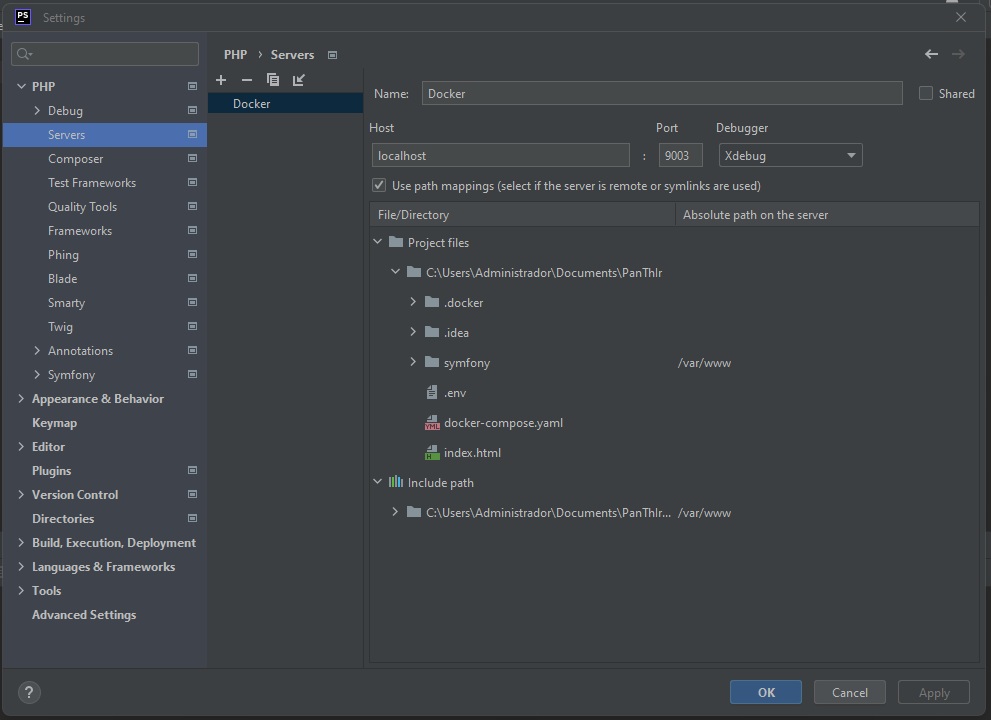

- [DevTools](#dev-tools)
  - [xdebug](#how-to-turn-on-xdebug-on-phpstorm)
  - [PhpStan](#phpstan)
  - [Deptrac](#deptrac)

## dev tools
There are some tools to keep the code quality and create some standards of coding.

*Some tools require to run some command inside a container*.

*So you can go to the* **project root** and run:
> docker-compose exec php-fpm bash

where "php-fpm" is the container name.

### How to turn on xdebug on phpstorm
Configure a server at settings -> PHP -> Servers

Configure a CLI at settings -> PHP '...' button

Configure the xdebug at settings -> PHP -> Debug

now you can start to use xdebug

### PHPStan
PHPStan scans your whole codebase and looks for both obvious & tricky bugs. 
Even in those rarely executed if statements that certainly aren't covered by tests.

> php vendor/bin/phpstan analyse src tests

### Deptrac
Deptrac is a static code analysis tool for PHP that helps you communicate, 
visualize and enforce architectural decisions in your projects. 
You can freely define your architectural layers over classes and which rules should apply to them.

> php vendor/bin/deptrac analyse