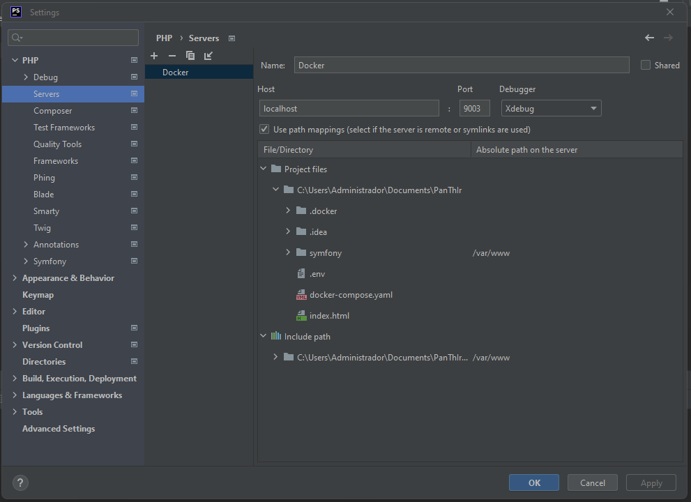
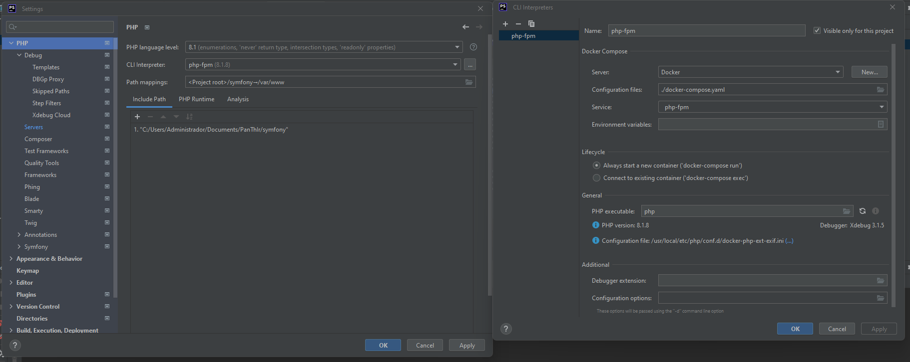
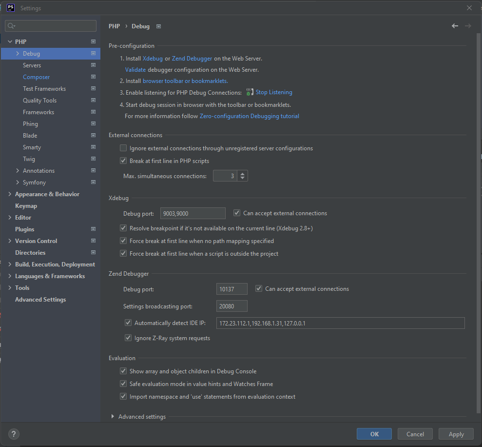

## How to turn on xdebug on phpstorm

Configure a server at settings -> PHP -> Servers

Configure a CLI at settings -> PHP '...' button

Configure the xdebug at settings -> PHP -> Debug

now you can start to use xdebug